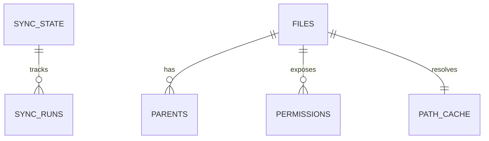

# Data Model

## Purpose

This Phase 0 note anchors the SQLite-first shape of the application before the full schema lands.

## Intended responsibilities

- `sync_state` stores account-level sync position
- `sync_runs` journals bootstrap and delta attempts
- `files`, `parents`, and `permissions` hold source metadata
- `path_cache` and duplicate projections remain rebuildable derived data

## Audit and history tables

`sync` replaces `files`/`parents`/`path_cache` wholesale on every run, so active
metadata only reflects current Drive state. Append-only history tables are
therefore the durable record of mutations and are never rewritten by sync:

- `audit_log` (V1, extended in V2) — one row per applied write action
  (`delete_permission`, retain-copy backup steps, trash). Columns: `at`,
  `command`, `action`, `file_id`, `permission_id`, `target_label`, `dry_run`,
  `source_file_id`, `backup_file_id`.
- `revoked_share_history` (V4) — a richer per-file snapshot captured when a share
  is revoked, so an operator can audit access that existed before it was removed.
  Columns: `revoked_at`, `command`, `file_id`, `file_name`, `file_path`,
  `grantee`, `grantee_type`, `role`, `permission_id`, `inherited`,
  `source_folder_id` (set when the grant was removed at an ancestor folder and
  cascaded), `revoked_via`, `note`.
- `trashed_file_history` (V5) — a richer per-file snapshot captured when files
  are moved to Google Drive trash. Recursive folder trash writes rows for the
  explicitly requested folder and every descendant from the pre-trash snapshot.
  Columns include `trashed_at`, `recoverable_until`, file identity/path/size/hash
  fields, `trashed_via_file_id`, `trashed_via_path`, `explicitly_requested`,
  descendant counts, `trash_via`, and `note`.

The `gdrive-core` `InventoryRepository` port exposes `append_audit_log` /
`load_audit_log` and `append_revoked_share` / `load_revoked_shares`; the unshare
apply path writes both for every affected file. It also exposes
`append_trashed_file` / `load_trashed_files`; the trash apply path writes
`trashed_file_history` for every affected file or folder.

## Phase 0 note

The migration skeleton exists now; the full schema is introduced as Phase 1 persistence work begins.
