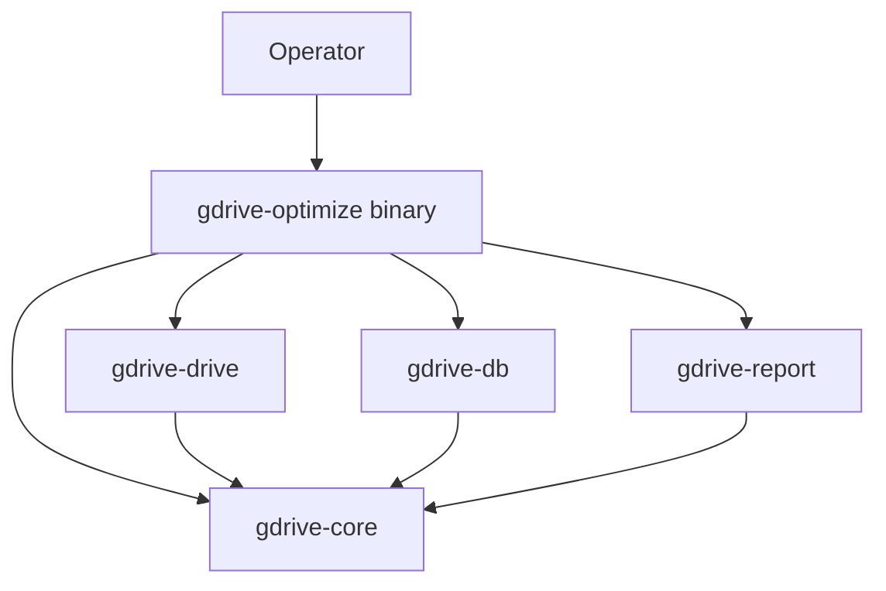

# Architecture Overview

## Purpose

This Phase 0 document fixes the high-level container boundaries before feature work begins. `gdrive-core` owns domain models and ports, adapter crates implement those ports, and the binary crate composes everything.

## Rules

- Dependencies point inward only.
- The binary crate is the only composition root.
- Adapter crates may depend on `gdrive-core`, but never on each other.
- Long-lived runtime data stays outside version control under `data/` and `reports/`.

## Phase 0 output

- workspace and crate layout created
- dependency direction encoded in manifests
- CLI shell scaffolded with stable command/help surface
