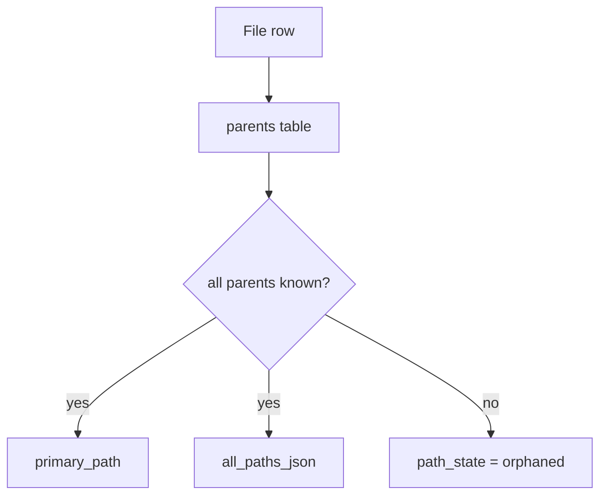

# Path Model

## Purpose

Human-readable paths are a product requirement, so the cache strategy is fixed early. Phase 0 documents the canonical display model before any SQL or rebuild logic is written.

## Rules

- `primary_path` is the default human-facing path.
- `all_paths_json` retains multi-parent edge cases.
- Missing parents do not drop rows; they mark `path_state = orphaned`.
- Path cache data is derived and rebuildable.

## Phase 1 handoff

The first real implementation must preserve orphan visibility and avoid path loss during interrupted sync runs.
