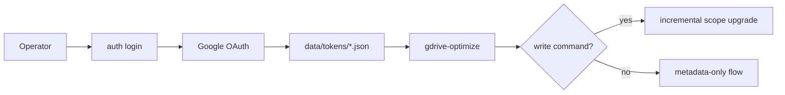

# Security

## Purpose

Phase 0 establishes the v0.0.1 security baseline: least-privilege OAuth, local token files with strict permissions, and signed-commit repository policy.

## Baseline controls

- `credentials.json` and token files are gitignored.
- Runtime token and credential files use `0600` permissions.
- Initial login requests metadata-readonly scope.
- Additional scopes are requested only on demand.
- Commits merged to the main branch must be cryptographically signed.

## Deferred items

- OS keyring integration
- multi-account profile separation
- Shared Drives policy details
