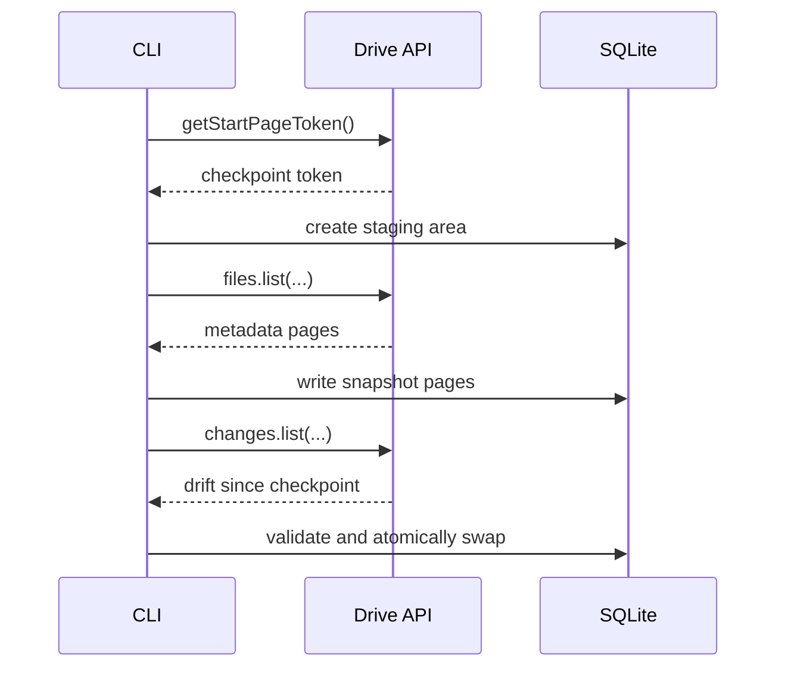

# Sync Engine

## Purpose

This document locks the crash-safety model before implementation. Phase 0 does not implement sync behavior, but it fixes the bootstrap and delta flow that later phases must preserve.

## Invariants

- Committed sync tokens advance only after DB changes commit.
- Reports read the last committed snapshot only.
- Full rebuilds use staging before swap.
- Delta pages are restart-safe from the last committed token.

## Phase 1 handoff

Phase 1 will add repository migrations, journaling, and `changes.list` replay on top of this contract.
