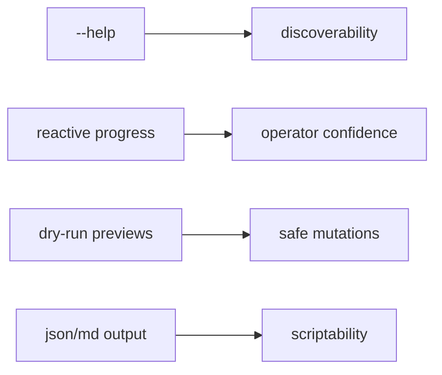

# CLI UX

## Purpose

The command line is a primary product surface. Phase 0 records the intended operator experience before implementation starts.

## UX baseline

- RGB output is used on capable terminals with textual fallbacks.
- Every command and subcommand must provide examples in help text.
- Mutations preview by default and require explicit apply semantics.
- Non-interactive mode suppresses redraw-based UI.
- Width-sensitive table rendering is preferred over hard-coded layouts.

## Selected libraries

- `anstream` + `anstyle`
- `indicatif`
- `comfy-table`
- `console`
