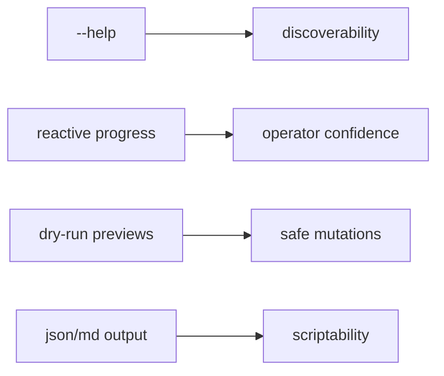

# CLI UX

## Purpose

The command line is the warden's primary console. Phase 0 records the intended operator experience before implementation starts.

## UX baseline

- RGB output is used on capable terminals with textual fallbacks.
- Every command and subcommand must provide examples in help text.
- Mutations preview by default and require explicit apply semantics under warden confirmation.
- Non-interactive mode suppresses redraw-based UI.
- Width-sensitive table rendering is preferred over hard-coded layouts.

## Warden console voice

User-facing prose uses facility metaphors; machine-readable keys stay stable (`file_id`, JSON field names, `inmates=` in roll-call output):

| Console / briefing | Meaning |
|--------------------|---------|
| Roll call complete | Sync finished |
| Warden briefing filed | Markdown report written |
| Warden rounds | `doctor` health check |
| Clearance revocation preview | `unshare` dry-run |
| Segregation preview / applied | `trash` dry-run / apply |
| Cell transfer preview / applied | `move` dry-run / apply |
| Intake ledger | Local SQLite DB (`db stats`) |
| SECURITY ALERT | Operator action required (`doctor` warnings) |
| WARNING | Attention briefing warnings (`report attention`) |

## Selected libraries

- `anstream` + `anstyle`
- `indicatif`
- `comfy-table`
- `console`
