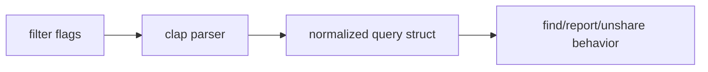

# Filter Flags

## Purpose

Phase 0 fixes the command filter surface as flag-based grammar only. This intentionally avoids introducing a positional DSL in the first implementation release.

## Supported filters

- `--name`
- `--mime`
- `--older-than`
- `--larger-than`
- `--in <folder-id>`
- `--path <glob>`
- `--shared`
- `--shared-with <anyone|domain:<name>|email:<addr>>`
- `--owner-scope <mine|all>`
- `--actionable-only`
- `--duplicate-of <id>`
- `--limit <n>`
- `--offset <n>`

## Notes

- `unshare` uses the same filter family as read-only query commands.
- Future DSL work, if any, is explicitly out of scope for `v0.0.1`.
