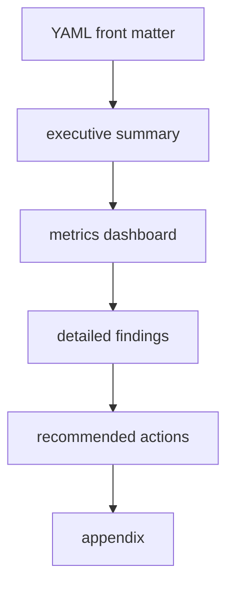

# Report Design

## Purpose

Reports are a first-class output format. Phase 0 fixes the structure so later implementation can focus on data generation instead of reshaping the document contract.

## Required sections

- front matter with generation metadata
- executive summary bullets
- metrics dashboard
- grouped detailed findings
- recommended commands using dry-run examples
- appendix with methodology and caveats

## Phase 2 handoff

Phase 2 will fill these sections using duplicate, sharing, and storage analyses from the local SQLite snapshot.
