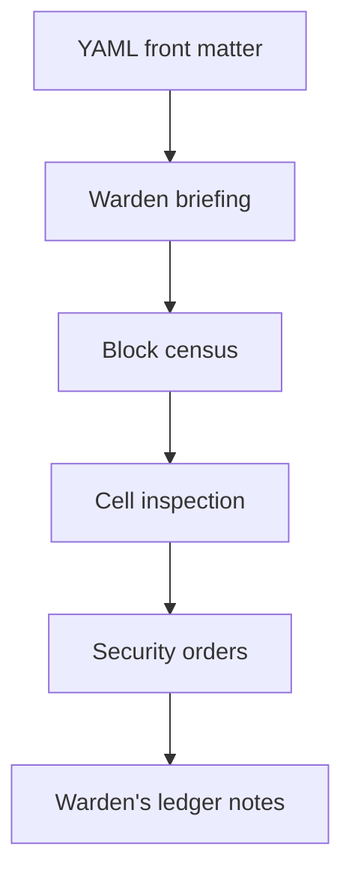

# Report Design

## Purpose

Warden briefings are a first-class output format. Markdown reports follow a fixed section contract so generators can focus on data, not document shape.



## Markdown report commands

These write files under `-o` (or the configured dated `reports/` directory):

| Command | Output file | Primary focus |
|---------|-------------|---------------|
| `report all` | `summary.md`, `duplicates.md`, `sharing.md`, `storage.md` | Full briefing pack |
| `report summary` | `summary.md` | Roll-up counts + live facility quota |
| `report duplicates` | `duplicates.md` | Identity collision groups |
| `report sharing` | `sharing.md` | Clearance violations |
| `report storage` | `storage.md` | Heavy and idle inmates + quota |

Front matter includes `generated_at`, `account`, `report`, and `warden: drive-warden`.

Live facility quota lines (`Facility quota consumed`, segregation hold, intake size limit) come from a best-effort `about.get` call when logged in. Ledger byte totals from the SQLite snapshot may differ slightly.

## Attention briefing (terminal only)

`report attention` does **not** write Markdown. It prints a table or JSON summary for triage:

- total inmates on the intake ledger
- shared-with-me counts and unbacked counts (when `--manifest` is provided)
- owned-and-shared file count
- exact-MD5 duplicate group counts
- segregation recoverability warnings (via `--trash-within-days`, default 7)
- remote DB release count and prune recommendation (via `--release-keep-last`, default 20)
- merged warden-rounds warnings (auth, remote DB, trash deadlines, backup gaps)

Example:

```bash
drive-warden report attention \
  --manifest backups/shared-with-me/manifest.jsonl \
  --trash-within-days 7 \
  --release-keep-last 20
```

## Required Markdown sections

- front matter with generation metadata and `warden: drive-warden`
- warden briefing bullets (executive summary)
- block census (metrics dashboard)
- grouped cell inspection (detailed findings)
- security orders with dry-run command examples
- warden's ledger notes with methodology and caveats

## Terminology

| Warden voice | Technical meaning |
|--------------|-----------------|
| Inmate | File |
| Cell / cell path | Folder / resolved path |
| Intake ledger | Local SQLite snapshot |
| Roll call | Sync |
| Warden briefing | Markdown or terminal operator summary |
| Clearance violation | Sharing finding |
| Segregation | Trash |
| Segregation hold | Drive trash quota / trashed items |
| Security orders | Recommended operator actions |
| Facility quota | Google account storage from `about.get` |

## Implementation notes

- `gdrive-report` renders Markdown; `report attention` is assembled in the `drive-warden` binary.
- Duplicate groups use MD5 first, then name+size when checksums are absent.
- Sharing rows distinguish warden-actionable vs informational clearance states.
