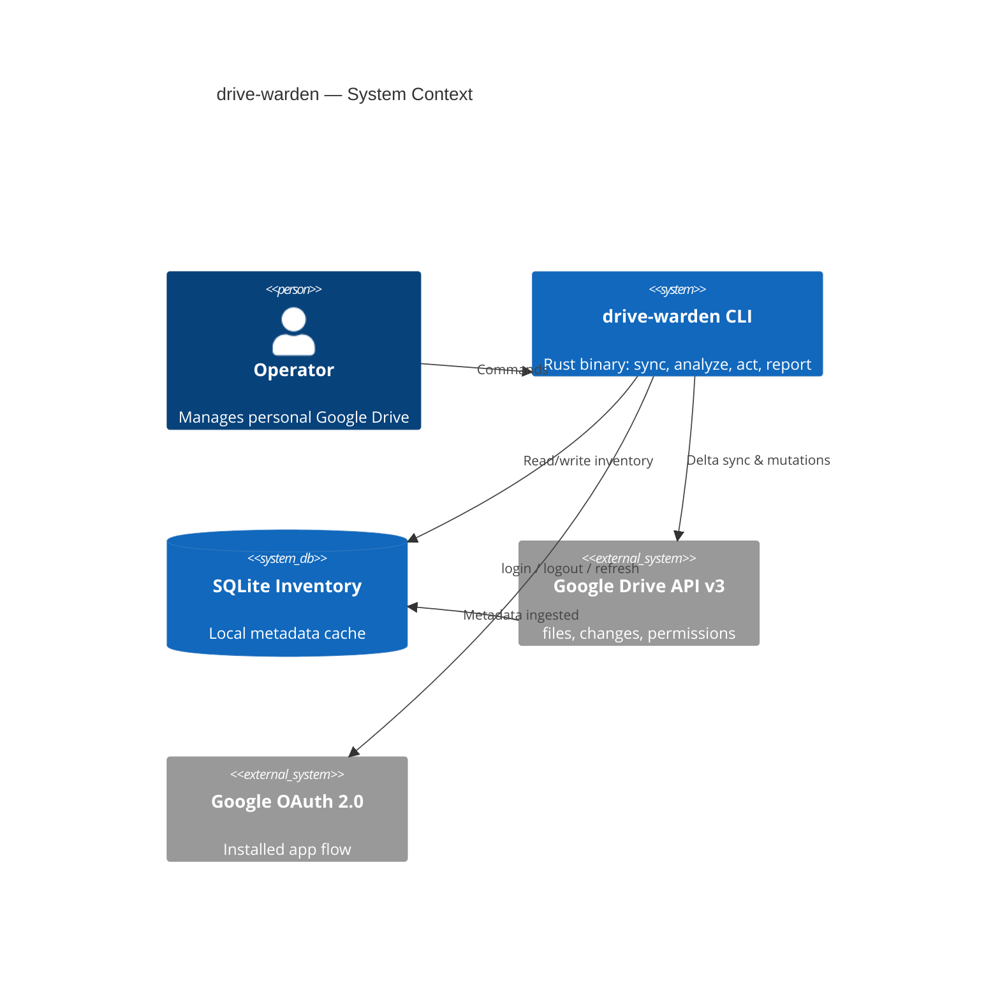
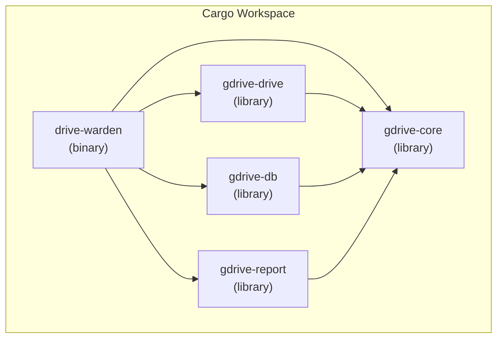
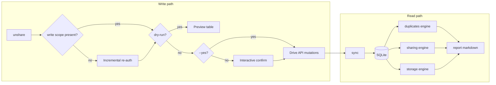
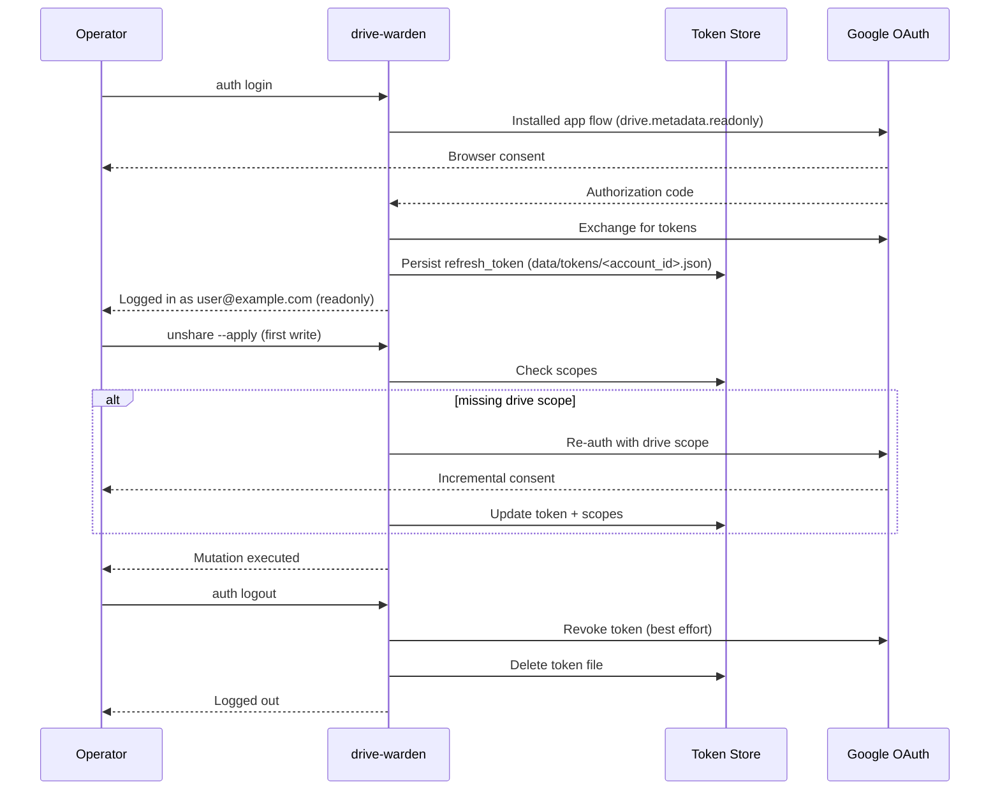
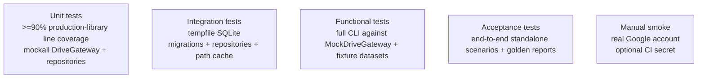
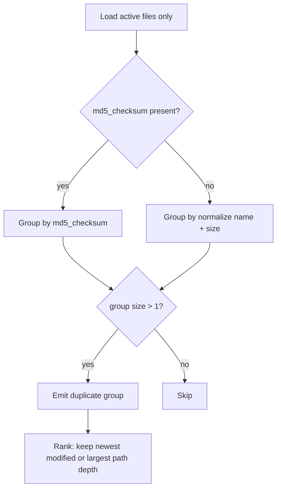

# drive-warden — Master Plan

> **Status:** live `My Drive` backend implemented; Shared Drives remain Phase 5 scope
> **Version:** 0.2.0-plan
> **Last updated:** 2026-06-01
> **Audience:** Operator (primary), contributors (secondary)

---

## 1. Executive summary

**drive-warden** is a Rust CLI that replaces the slow, opaque Google Drive web UI with a fast, local-first command-line experience. It maintains a **SQLite inventory** of every file and folder the operator can access, updated incrementally via the **Google Drive Changes API**, so repeated runs avoid re-fetching unchanged metadata.

The operator can:

- **Authenticate** with their Google account (`auth login` / `auth logout`)
- **Sync** inventory (full bootstrap or delta-only)
- **Inspect** duplicates, sharing exposure, storage pressure, and stale content
- **Act** on findings (`unshare`, recoverable `trash`) with dry-run by default
- **Report** executive summaries and detailed findings as Markdown files

Design priorities: **correctness**, **operator safety** (dry-run, confirmations), **API efficiency** (delta sync, field masks, batching), **testability** (high production-library coverage via trait-based boundaries), **CLI UX quality** (RGB, reactive, accessible, terminal-aware), and **sustainability** (minimize redundant API traffic and encourage long-term storage discipline).

---

## 2. Problem statement

| Pain (web UI) | drive-warden response |
|---------------|--------------------------|
| Slow to answer “what do I have?” | Local SQLite queries in milliseconds |
| Hard to find duplicates | Indexed `md5_checksum` + name/size heuristics |
| Sharing visibility is buried | `permissions` table + `report sharing` |
| No bulk cleanup workflow | `unshare` and recoverable `trash`; permanent delete remains deferred |
| Re-loading unchanged files wastes time & energy | Delta sync via stored `start_page_token` |
| Storage quota anxiety | `report storage` with tiered recommendations |

### Sustainability (CO₂) principle

Every unnecessary `files.get` or full-tree crawl has a real energy cost. The application **must not re-download or re-query metadata for unchanged files**. The local database is the source of truth for analysis; the Drive API is consulted only for **sync deltas**, **mutations**, and **on-demand content inspection** (e.g. EXIF extraction) when explicitly requested.

---

## 3. Goals and non-goals

### Goals

1. Fast, scriptable CLI for inventory, analysis, and remediation
2. OAuth 2.0 installed-app flow for the operator’s Google account
3. SQLite cache with rich metadata (size, type, dates, MD5 where available, permissions, optional EXIF)
4. Delta-only sync after initial bootstrap
5. Markdown reports with executive summary + detailed appendix
6. `make test`, `make lint`, `make clean`, RGB categorized `make help`
7. Production-library coverage gate enforced in CI / Makefile (`cargo-llvm-cov`, `>=90%` lines)
8. Comprehensive `docs/` with architecture, design, and UML (Mermaid)

### Non-goals (v1)

- Graphical UI or TUI
- Real-time push notifications (`changes.watch` webhooks) — polling delta sync is sufficient
- Editing Google Docs/Sheets content in-place
- Multi-user / team admin (single operator, single Google account per profile)
- Storing file **content** locally (metadata only unless operator explicitly runs `inspect exif` in v1)
- Service-account / Workspace domain-wide delegation (future phase)
- **Shared Drives** — My Drive only; see Phase 5
- **Permanent trash cleanup** — trashed items are excluded from sync, analysis, and reports; no permanent delete or empty-trash commands in v1

### Release and collaboration conventions

- The project follows **Semantic Versioning 2.0.0** for all public releases and tags.
- The first implementation release covered by this plan is **`v0.0.1`**.
- In this document, **"v1" refers to the initial feature scope**, not the public semantic-version major number.
- Until `1.0.0`, breaking changes may still occur in minor releases, but release tags, changelogs, and compatibility notes must still follow semantic-versioning rules.
- Release tags use the `vX.Y.Z` form, for example `v0.0.1`, `v0.1.0`, and `v1.0.0`.
- Git commits must follow **Conventional Commits**, for example `feat(sync): add bootstrap replay` or `fix(report): handle orphaned paths`.
- Pull request titles must use the same **Conventional Commits** header format as commit subjects.
- Branch names must use lowercase kebab-case in the form `<type>/<short-description>`, for example `feat/bootstrap-sync`, `fix/path-cache`, or `docs/plan-hardening`.
- All authored commits that enter the main branch must be **cryptographically signed** (GPG or SSH signing is acceptable).
- Repository policy should enforce signed commits and reject unsigned commits where the hosting platform allows it.

---

## 4. Technology stack

| Layer | Choice | Rationale |
|-------|--------|-----------|
| Language | **Rust** (edition 2021, latest stable pinned in `rust-toolchain.toml` during Phase 0) | Performance, safety, excellent CLI ecosystem |
| CLI framework | **clap** v4 (derive) | Industry standard; subcommands, completions, man pages |
| Async runtime | **tokio** | Required by `google-drive3` / hyper stack |
| Google API | **google-drive3** + **google-apis-common** | Official auto-generated Drive v3 client |
| OAuth | **yup-oauth2** (installed flow) | Same stack as google-apis-rs; persistent token storage |
| Database | **rusqlite** + **refinery** | Embedded, zero-ops, portable |
| Serialization | **serde** / **serde_json** | API + config + report templates |
| Errors | **thiserror** + **anyhow** (binary only) | Typed errors in lib, ergonomic CLI |
| Logging | **tracing** + **tracing-subscriber** | Structured, filterable (`RUST_LOG`) |
| Time | **chrono** | Drive RFC3339 timestamps |
| Testing | **mockall**, **tokio-test**, **tempfile**, **assert_cmd** | Mocks at trait boundaries; CLI integration smoke |
| Coverage | **cargo-llvm-cov** | Enforce >=90% line coverage on production library crates |
| Lint | **clippy** (`-D warnings`), **rustfmt** | `make lint` |
| EXIF (optional) | Drive `imageMediaMetadata` | Byte-download parsing remains deferred |

### Google Cloud setup (operator one-time)

1. Create a project in [Google Cloud Console](https://console.cloud.google.com/)
2. Enable **Google Drive API**
3. Create **OAuth 2.0 Client ID** → type **Desktop app**
4. Download `credentials.json` → place in `data/` (gitignored) or path from `DRIVE_WARDEN_CREDENTIALS`
5. On first `auth login`, browser opens; tokens stored in `data/tokens/` with local file protections (`0600`) — see §8

**OAuth scopes (least-privilege, upgraded on demand):**

| Scope | When requested | Purpose |
|-------|----------------|---------|
| `https://www.googleapis.com/auth/drive.metadata.readonly` | `auth login` (default) | Sync, find, report — My Drive metadata only |
| `https://www.googleapis.com/auth/drive.readonly` | `inspect exif` | Read Drive `imageMediaMetadata`; byte-download fallback is deferred |
| `https://www.googleapis.com/auth/drive` | First mutating command (`unshare`, `trash`, etc.) | Permission changes and recoverable trash moves |

On first write attempt without `drive` scope, the CLI prompts: *"This action requires additional permissions"* and re-runs the OAuth flow with the broader scope (incremental consent). `auth status` shows active scopes.

---

## 5. System architecture

### 5.1 High-level context



### 5.2 Crate layout (Cargo workspace)



| Crate | Responsibility |
|-------|----------------|
| `drive-warden` | CLI entrypoint, clap parsing, human output, exit codes, dependency wiring |
| `gdrive-core` | Domain types, ports, use cases, sync orchestration, duplicate/sharing/storage analysis |
| `gdrive-drive` | Google Drive adapter implementing core ports via `google-drive3` / `yup-oauth2` |
| `gdrive-db` | SQLite adapter implementing repositories, migrations, sync journaling, path cache persistence |
| `gdrive-report` | Markdown presenters/renderers over core report models; no direct DB access |

### 5.2.1 Adapter implementations required in v1

| Port | Production adapter | Test / standalone adapter |
|------|--------------------|---------------------------|
| Drive API | `GoogleDriveGateway` | `MockDriveGateway` (fixture-driven, no network) |
| Token store | file-backed token storage | tempdir/in-memory token store |
| Inventory repository | SQLite repository | temp SQLite repository |
| Report writer | filesystem writer | tempdir writer / snapshot verifier |

**Architecture style (required):**

- **Ports and adapters**: `gdrive-core` defines traits; adapter crates implement them
- **Composition root**: only the binary crate wires concrete adapters together
- **Repository pattern**: persistence behind explicit repository interfaces
- **Functional core / imperative shell**: pure analysis logic separated from I/O and CLI side effects
- **Rebuildable projections**: duplicate groups and path caches are derived data that can be recomputed

**Rule:** Dependencies point inward only. `gdrive-core` must not depend on adapter crates. This avoids cyclic dependencies and keeps the application extensible over time.

### 5.3 Sync pipeline

```mermaid
sequenceDiagram
    participant Op as Operator
    participant CLI as drive-warden
    participant DB as SQLite
    participant API as Drive API

    Op->>CLI: drive-warden sync
    CLI->>DB: Open sync_run(status=in_progress)

    alt First run or --full
        CLI->>API: changes.getStartPageToken()
        API-->>CLI: checkpoint token T0
        CLI->>DB: Create staging tables for run
        loop Full crawl
            CLI->>API: files.list(corpora=user, q="trashed=false")
            API-->>CLI: My Drive metadata pages
            CLI->>DB: Upsert into staging tables
        end
        loop Replay drift since T0
            CLI->>API: changes.list(pageToken=T0, restrictToMyDrive=true)
            API-->>CLI: Changed / removed file IDs
            CLI->>DB: Apply deltas into staging tables
        end
        CLI->>DB: Validate staging (FKs, counts, path cache)
        CLI->>DB: Atomic swap staging -> live tables; save committed token
    else Delta run
        CLI->>DB: Load committed token Tn
        loop Delta pages
            CLI->>API: changes.list(pageToken=Tn, restrictToMyDrive=true)
            API-->>CLI: Changed / removed file IDs
            CLI->>DB: Transactionally apply page
            CLI->>DB: Rebuild affected path cache entries
        end
        CLI->>DB: Commit new token Tn+1 and mark sync_run committed
    end

    CLI-->>Op: Summary (N added, M updated, K removed, token advanced)
```

**Crash-safety invariants:**

1. The application never advances the committed page token until the corresponding DB changes are committed.
2. Bootstrap writes into **staging tables**, not live tables, then swaps atomically only after validation.
3. Delta runs are **idempotent**: if interrupted, the next run restarts from the last committed token.
4. Reports run only against the **last committed snapshot**, never partially synced state.

### 5.4 Alternative & failure flows

| Scenario | Required behavior |
|----------|-------------------|
| Missing `credentials.json` | Fail with clear setup instructions and example path/env var |
| Refresh token revoked / expired | `auth status` reports invalid token; `sync` exits with re-login guidance |
| Insufficient scope for write | Prompt for scope upgrade, preserve current session if declined |
| `changes.list` returns `410 Gone` | Mark token invalid and require crash-safe `sync --full` rebuild |
| Interrupted full sync | Keep previous committed snapshot active; unfinished `sync_run` marked failed/abandoned |
| Interrupted delta sync | Re-run from old token with no data corruption |
| File shared but operator cannot change it | Report as visible/non-actionable with reason (`not_owner`, `inherited_permission`, etc.) |
| Unresolved parent/path | Keep item in inventory, mark path state as `orphaned`, surface in diagnostics/report |

### 5.5 Analysis & action flow



---

## 6. Data model (SQLite)

### 6.1 Design principles

- **My Drive only** — `corpora=user`, `supportsAllDrives=false`; no Shared Drives or "Shared with me" in v1
- **My Drive inventory is not the same as owned files** — v1 inventories all items visible in My Drive, but write actions are gated by ownership/capability checks
- **Trash excluded** — `q='trashed=false'` on bootstrap; delta changes that move files to trash **remove** them from the local DB (never inventory trash)
- **Crash-safe sync** — live tables represent only the last committed snapshot; bootstrap uses staging tables and delta uses committed tokens
- **Normalized** parents (Drive allows multiple parents for files)
- **Materialized path cache** for fast UX, with explicit path-state tracking
- **Denormalized counters** for fast storage reports (maintained on sync)
- **JSON columns** for variable-length metadata (imageMediaMetadata, videoMediaMetadata, exportLinks)
- **Source vs derived data** — raw inventory tables are source-of-truth; duplicate groups and path caches are rebuildable projections
- **Strict referential integrity** — `PRAGMA foreign_keys=ON`; child rows use `ON DELETE CASCADE`
- Optional **remote DB sync**: SQLite file stored in a private visible My Drive folder with SHA-256 manifest; hidden `appDataFolder` mode remains deferred

### 6.2 Core tables (v1)

```sql
-- sync_state: one row per connected Google account
CREATE TABLE sync_state (
    account_id               TEXT PRIMARY KEY,  -- Google user id from about.get
    email                    TEXT NOT NULL,
    committed_start_page_token TEXT,
    committed_generation     INTEGER NOT NULL DEFAULT 0,
    active_scopes_json       TEXT NOT NULL DEFAULT '[]',
    last_full_sync_at        TEXT,
    last_delta_sync_at       TEXT,
    last_sync_status         TEXT NOT NULL DEFAULT 'never',
    quota_bytes_total        INTEGER,
    quota_bytes_used         INTEGER
);

CREATE TABLE sync_runs (
    run_id             TEXT PRIMARY KEY,
    account_id         TEXT NOT NULL REFERENCES sync_state(account_id) ON DELETE CASCADE,
    mode               TEXT NOT NULL,     -- full, delta
    status             TEXT NOT NULL,     -- in_progress, committed, failed, abandoned
    source_page_token  TEXT,
    committed_page_token TEXT,
    generation         INTEGER NOT NULL,
    started_at         TEXT NOT NULL,
    completed_at       TEXT,
    error_text         TEXT
);

CREATE TABLE files (
    id                TEXT PRIMARY KEY,
    name              TEXT NOT NULL,
    mime_type         TEXT NOT NULL,
    size              INTEGER,           -- NULL for native Google formats
    md5_checksum      TEXT,            -- NULL for Google Docs, Sheets, etc.
    created_time      TEXT,
    modified_time     TEXT,
    viewed_by_me_time TEXT,
    starred           INTEGER NOT NULL DEFAULT 0,
    shared            INTEGER NOT NULL DEFAULT 0,
    owned_by_me       INTEGER NOT NULL DEFAULT 0,
    operator_can_share_manage INTEGER NOT NULL DEFAULT 0,
    web_view_link     TEXT,
    icon_link         TEXT,
    thumbnail_link    TEXT,
    description       TEXT,
    sha1_checksum     TEXT,
    sha256_checksum   TEXT,
    image_metadata_json TEXT,            -- imageMediaMetadata
    video_metadata_json TEXT,
    properties_json   TEXT,
    app_properties_json TEXT,
    export_links_json TEXT,
    capabilities_json TEXT,
    shortcut_details_json TEXT,
    drive_space       TEXT NOT NULL DEFAULT 'drive',
    generation        INTEGER NOT NULL,
    synced_at         TEXT NOT NULL,
    content_inspected_at TEXT            -- EXIF fetch timestamp
);

CREATE TABLE parents (
    file_id           TEXT NOT NULL REFERENCES files(id) ON DELETE CASCADE,
    parent_id         TEXT NOT NULL,     -- folder id or 'root'
    PRIMARY KEY (file_id, parent_id)
);

CREATE TABLE permissions (
    id                TEXT NOT NULL,
    file_id           TEXT NOT NULL REFERENCES files(id) ON DELETE CASCADE,
    type              TEXT NOT NULL,     -- user, group, domain, anyone
    role              TEXT NOT NULL,     -- owner, writer, commenter, reader
    email_address     TEXT,
    domain            TEXT,
    display_name      TEXT,
    allow_file_discovery INTEGER NOT NULL DEFAULT 0,
    inherited         INTEGER NOT NULL DEFAULT 0,
    inherited_from_id TEXT,
    permission_view   TEXT,
    pending_owner     INTEGER NOT NULL DEFAULT 0,
    expiration_time   TEXT,
    deleted           INTEGER NOT NULL DEFAULT 0,
    raw_json          TEXT,
    PRIMARY KEY (file_id, id)
);

CREATE TABLE path_cache (
    file_id           TEXT PRIMARY KEY REFERENCES files(id) ON DELETE CASCADE,
    primary_path      TEXT NOT NULL,
    all_paths_json    TEXT NOT NULL,
    depth             INTEGER NOT NULL DEFAULT 0,
    path_state        TEXT NOT NULL,     -- resolved, multi_parent, orphaned
    updated_at        TEXT NOT NULL
);

CREATE TABLE duplicate_groups (
    group_id          TEXT PRIMARY KEY,
    match_type        TEXT NOT NULL,     -- md5, name_size, fuzzy
    created_at        TEXT NOT NULL
);

CREATE TABLE duplicate_members (
    group_id          TEXT NOT NULL REFERENCES duplicate_groups(group_id) ON DELETE CASCADE,
    file_id           TEXT NOT NULL REFERENCES files(id) ON DELETE CASCADE,
    PRIMARY KEY (group_id, file_id)
);

CREATE TABLE audit_log (
    id                INTEGER PRIMARY KEY AUTOINCREMENT,
    at                TEXT NOT NULL,
    command           TEXT NOT NULL,
    action            TEXT NOT NULL,
    file_id           TEXT,
    details_json      TEXT,
    dry_run           INTEGER NOT NULL
);
```

### 6.3 Indexes

```sql
CREATE INDEX idx_files_md5 ON files(md5_checksum) WHERE md5_checksum IS NOT NULL;
CREATE INDEX idx_files_name_size ON files(name, size);
CREATE INDEX idx_files_mime ON files(mime_type);
CREATE INDEX idx_files_modified ON files(modified_time);
CREATE INDEX idx_files_actionable ON files(operator_can_share_manage);
CREATE INDEX idx_permissions_email ON permissions(email_address);
CREATE INDEX idx_permissions_type ON permissions(type, allow_file_discovery);
CREATE INDEX idx_parents_parent ON parents(parent_id);
CREATE INDEX idx_path_cache_primary_path ON path_cache(primary_path);
CREATE INDEX idx_sync_runs_status ON sync_runs(status, started_at);
```

### 6.4 Google API metadata mapping

| Drive `File` field | SQLite column | Notes |
|------------------|---------------|-------|
| `id` | `files.id` | Stable |
| `md5Checksum` | `md5_checksum` | **Binary files only** |
| `size` | `size` | Native Google files may report 0 or omit |
| `imageMediaMetadata` | `image_metadata_json` | Includes EXIF-like fields without download |
| `exportLinks` | `export_links_json` | Present for Google-native files that support export |
| `capabilities` | `capabilities_json` + `operator_can_share_manage` | Used to decide if unshare is actionable |
| `permissions` | `permissions` table | Must preserve direct vs inherited vs public-link semantics |
| `parents` | `parents` | Multi-parent supported |
| `shortcutDetails` | `shortcut_details_json` | Required for accurate UX and path reporting |

**Content / EXIF policy:** Use API-provided `imageMediaMetadata` for `inspect exif <file>`. Byte-download EXIF parsing is deferred and is never part of routine sync.

### 6.4.1 Drive API request contract (v1)

The implementation must use a single, explicit request contract so the schema, sync logic, and mock backend stay aligned.

**Bootstrap inventory (`files.list`)**

- `corpora=user`
- `spaces=drive`
- `q="trashed=false"`
- `pageSize=1000`
- `supportsAllDrives=false`
- `includeItemsFromAllDrives=false`
- `fields=nextPageToken,files(id,name,mimeType,size,md5Checksum,createdTime,modifiedTime,viewedByMeTime,starred,shared,ownedByMe,webViewLink,iconLink,thumbnailLink,description,sha1Checksum,sha256Checksum,imageMediaMetadata,videoMediaMetadata,properties,appProperties,exportLinks,capabilities,shortcutDetails,parents,permissions)`

**Checkpoint token (`changes.getStartPageToken`)**

- `supportsAllDrives=false`

**Delta inventory (`changes.list`)**

- `pageToken=<committed token>`
- `spaces=drive`
- `pageSize=1000`
- `restrictToMyDrive=true`
- `includeRemoved=true`
- `includeCorpusRemovals=true`
- `supportsAllDrives=false`
- `includeItemsFromAllDrives=false`
- `fields=nextPageToken,newStartPageToken,changes(fileId,removed,file(id,name,mimeType,size,md5Checksum,createdTime,modifiedTime,viewedByMeTime,starred,shared,ownedByMe,webViewLink,iconLink,thumbnailLink,description,sha1Checksum,sha256Checksum,imageMediaMetadata,videoMediaMetadata,properties,appProperties,exportLinks,capabilities,shortcutDetails,parents,permissions))`

**Mutations (`permissions.delete`)**

- `supportsAllDrives=false`
- Only direct, removable permissions are eligible in v1; inherited or non-actionable permissions are reported but never mutated

The mock backend must model the same request/response surface, including removed items, incomplete parent chains, and permission/actionability edge cases.

### 6.5 Path resolution strategy

- The application maintains a **materialized path cache** in `path_cache` for fast, human-readable output.
- Path cache entries are rebuilt for the affected subtree after each delta page and rebuilt globally after bootstrap.
- `primary_path` is the canonical display path; `all_paths_json` retains all known paths for multi-parent edge cases.
- If a parent is missing or not yet resolved, the file is retained with `path_state='orphaned'` instead of being dropped.
- Reports and `find` output must show **path + file id + owner/actionability state**, not just names.

---

## 7. CLI specification

Binary name: **`drive-warden`** (alias: `gdo` optional via symlink or clap alias).

### 7.1 Global flags

| Flag | Description |
|------|-------------|
| `-h, --help` | Show command help, examples, and relevant flags without side effects |
| `--config <path>` | Config file (default: `data/config.toml`) |
| `--db <path>` | SQLite path (default: `data/inventory.db`) |
| `--backend <google\|mock>` | Select production or fixture-driven backend |
| `-v, --verbose` | Increase logging verbosity; repeatable (`-vv`, `-vvv`) |
| `-q, --quiet` | Reduce output to warnings/errors; suppress reactive UI where appropriate |
| `--color <auto\|always\|never>` | Output styling |
| `--format <table\|json\|md>` | Machine-readable output |
| `--no-interactive` | Disable prompts, spinners, and live refresh UI |
| `--tty-width <cols>` | Override detected terminal width for testing/rendering |

**Global flag contract (required)**

- Every command and subcommand supports `--help`
- `--help` must be side-effect free and must not require auth, config, DB, or network access
- Help text must include: purpose, common examples, key flags, and safety notes for mutating commands
- `-v/--verbose` is cumulative:
  - default: concise operator output
  - `-v`: informational logs
  - `-vv`: debug-oriented logs and phase timing
  - `-vvv`: very detailed troubleshooting output suitable for bug reports
- `-q/--quiet` overrides reactive summaries and prints only essential output
- `--dry-run` is mandatory on every mutating command family in v1 and is the default mode
- `--apply` must be explicit to perform writes
- `--yes` bypasses confirmation prompts only when `--apply` is also present

Mutating commands without `--apply` must behave exactly like preview operations; they must never partially mutate state.

### 7.1.1 CLI UX requirements

The CLI is a primary product surface, not a thin wrapper. v1 must feel **fast, colorful, reactive, and safe** in a terminal-first workflow.

**Required UX principles**

- **RGB by default** on TTYs: semantic color palette for status, severity, actionability, and summaries
- **Reactive output**: live progress during sync/report generation; dynamic redraw on TTY, plain logs otherwise
- **Terminal-aware layouts**: adapt tables, truncation, wrapping, and column selection to current width
- **Progressive disclosure**: concise summaries first, details on demand
- **Safe interactivity**: confirmations and previews for writes; never require interactivity in scripts
- **Accessible fallback**: all color semantics also expressed with text/icons/labels so `--color never` remains fully usable

**Reactive behaviors required in v1**

- `sync` shows spinner/progress bar, current phase, page counts when known, and a live rolling summary (`added`, `updated`, `removed`, `token state`)
- `report all` shows report stages as they complete and where files are being written
- `unshare --dry-run` shows a preview list with live totals by category (`actionable`, `non-actionable`, `public`, `domain`, `direct`)
- Long operations emit stable, non-flickering updates on TTY and line-oriented logs in non-interactive mode

**Semantic color mapping**

| Meaning | Color intent |
|---------|--------------|
| Success / synced / safe | RGB green |
| Warning / stale / review needed | RGB amber |
| Dangerous / public / destructive | RGB red |
| Informational / headings / paths | RGB blue |
| Muted metadata / secondary text | RGB gray |

Selected implementation: `anstream` + `anstyle` for color, `indicatif` for progress bars/spinners, `comfy-table` for adaptive tables, and `console` for terminal capability helpers.

### 7.2 Commands

```text
drive-warden
├── auth
│   ├── login          # OAuth installed flow; stores refresh token
│   ├── logout         # Revoke token + delete local credentials
│   └── status         # Show connected account + token expiry
├── sync
│   ├── (default)      # Delta sync if token exists, else bootstrap
│   └── --full         # Force full files.list rebuild
├── report
│   ├── all            # Generate full report pack
│   ├── duplicates     # Duplicate files report
│   ├── sharing        # Who has access to what
│   ├── storage        # Quota, large files, stale files
│   └── summary        # Executive summary only
├── find
│   ├── duplicates     # Interactive duplicate listing
│   ├── shared         # Files with non-owner permissions
│   └── large --min <bytes>
├── inspect
│   ├── file <id>      # Dump metadata from DB
│   └── exif <id>      # Read Drive image metadata (may prompt scope upgrade)
├── unshare
│   └── [filters...]   # Remove permissions selected by filter flags
├── trash
│   └── [filters...]   # Move selected files/folders to recoverable Drive trash
└── db
    ├── stats          # Table counts, DB size
    └── vacuum         # Optimize SQLite

# Deferred (post-v1):
#   empty-trash, permanent delete, move
```

**Filter grammar (v1):** all queryable commands use **flag-based filters only**; there is no positional query DSL in v1. Supported filters: `--name`, `--mime`, `--older-than`, `--larger-than`, `--in <folder-id>`, `--path <glob>`, `--shared`, `--shared-with <anyone|domain:<name>|email:<addr>>`, `--owner-scope <mine|all>`, `--actionable-only`, `--duplicate-of <id>`.

**Command-specific flags (v1):**

- `inspect file <id> --refresh` performs a one-file API refresh and writes the updated metadata back into the local DB; default behavior reads only the last committed snapshot
- `sync --full` ignores the committed token and rebuilds from `files.list` into staging tables before atomic swap
- `report <kind> -o <dir>` writes report files under the requested directory; if omitted, use configured `reports/<date>/`
- `find * --limit <n>` and `find * --offset <n>` are supported for deterministic paging in scripts
- `unshare [filters...] --dry-run` previews matching direct removable permissions only; non-actionable matches remain visible in preview with explicit reason labels
- `unshare [filters...] --apply --yes` executes only on rows marked actionable in the preview model
- `trash [filters...] --dry-run` previews recoverable trash moves; folder rows require `--recursive` before apply
- `trash [filters...] --recursive --apply --yes` moves only actionable rows to Drive trash and never permanently deletes files

**Safety defaults:**

- All mutating commands default to **`--dry-run`**
- Require **`--apply`** to execute
- Require **`--yes`** for non-interactive scripts
- Log every mutation to `audit_log`

### 7.2.1 Help and ergonomics contract

Each top-level command must provide a high-quality `--help` page with:

- one-line purpose statement
- 2-5 realistic examples
- operator-oriented explanation of important flags
- safety notes for commands that can change remote state
- clear mention of defaults, especially for `--dry-run`, `--format`, and output directories

Top-level command help must be available for:

- `drive-warden --help`
- `drive-warden auth --help`
- `drive-warden sync --help`
- `drive-warden report --help`
- `drive-warden find --help`
- `drive-warden inspect --help`
- `drive-warden unshare --help`
- `drive-warden db --help`

### 7.2.2 Output modes by command

| Command | TTY behavior | Non-TTY behavior |
|---------|--------------|------------------|
| `sync` | Reactive progress + final RGB summary card | Line-oriented progress + final summary |
| `find *` | Colorized adaptive table, optional paging | Plain table / JSON / Markdown |
| `report *` | Stage progress + output paths | Deterministic file/log output |
| `inspect file` | Sectioned card layout with highlighted risks | Plain structured text / JSON |
| `unshare --dry-run` | Preview table + category counters | Deterministic preview rows |
| `unshare --apply` / `trash --apply` | Confirm -> progress -> result summary | No prompt unless explicitly allowed |

### 7.2.3 Operator-control rules

The operator must be able to discover, preview, and control behavior without reading source code.

- Discovery: `--help` explains commands and defaults
- Visibility: `--verbose` increases operational detail without changing behavior
- Safety: `--dry-run` previews all write operations
- Determinism: `--format json|md` and paging flags make outputs scriptable
- Silence when needed: `--quiet` and `--no-interactive` suppress reactive UI for automation
- Explainability: non-actionable rows must include reason labels in preview and final summaries

### 7.3 Example session

```bash
make build
./target/release/drive-warden auth login      # readonly scope
./target/release/drive-warden sync            # first run: My Drive bootstrap
./target/release/drive-warden report all -o reports/2026-05-28/
./target/release/drive-warden find duplicates
./target/release/drive-warden unshare --shared-with anyone --dry-run
./target/release/drive-warden unshare --shared-with anyone --apply --yes  # upgrades scope
./target/release/drive-warden auth logout
```

---

## 8. Authentication & secrets



| Asset | Location | Permissions |
|-------|----------|-------------|
| OAuth client secret | `data/credentials.json` | `0600`, gitignored |
| Refresh tokens | `data/tokens/*.json` | `0600`, gitignored |
| Config | `data/config.toml` | Non-secret preferences |

Implement custom `yup_oauth2::storage::TokenStorage` writing to `data/tokens/`.

---

## 9. Report format

Reports written to `reports/<YYYY-MM-DD>/<type>.md` (configurable via `-o`).

### 9.1 Structure (every report)

1. **YAML front matter** — generated_at, account, db_sync_age, command version
2. **Executive summary** — 5–15 bullets, key metrics, top actions
3. **Metrics dashboard** — tables: total files, size, shared count, duplicate waste
4. **Detailed findings** — per-file tables, grouped by severity
5. **Recommended actions** — copy-paste CLI commands with `--dry-run`
6. **Appendix** — methodology, limitations, API field caveats

### 9.2 Example executive summary snippet

```markdown
## Executive summary

- **127 GB** used of **200 GB** quota (63.5%)
- **1,842** duplicate files wasting **~4.2 GB** (MD5-verified)
- **38** files shared publicly (`anyoneWithLink`)
- **214** files not opened in 24+ months (candidate archive)
- Largest consumer: `Videos/` at 61 GB

**Suggested next steps**
1. Run `gdo report sharing` and review public links
2. Dry-run: `gdo unshare --shared-with anyone --dry-run`
```

---

## 10. Makefile design

### 10.1 Targets by category

| Category | Targets |
|----------|---------|
| **Help** | `help` |
| **Build** | `build`, `build-release`, `install` |
| **Test** | `test`, `test-unit`, `test-integration`, `test-functional`, `test-acceptance`, `test-coverage`, `test-doc`, `test-all` |
| **Lint** | `lint`, `fmt`, `fmt-check`, `clippy` |
| **Run** | `run`, `sync`, `report` (dev shortcuts) |
| **Fixtures** | `fixtures-validate`, `fixtures-update` |
| **Docs** | `docs`, `docs-serve` |
| **Clean** | `clean`, `clean-all` |
| **Setup** | `setup`, `check-deps` |

### 10.1.1 Make target to CLI mapping

Make targets are convenience wrappers. The CLI remains the source of truth for runtime behavior.

| Make target | Underlying command contract |
|-------------|-----------------------------|
| `make build` | `cargo build --workspace` |
| `make build-release` | `cargo build --workspace --release` |
| `make run` | `cargo run -p drive-warden -- --help` or configured dev entrypoint |
| `make sync` | `cargo run -p drive-warden -- sync` |
| `make report` | `cargo run -p drive-warden -- report all` |
| `make test` | offline fast gate: unit + integration + functional |
| `make test-all` | unattended completion gate: lint + test + acceptance + docs |
| `make lint` | formatting + clippy + any plan-defined lint checks |
| `make clean` | remove Rust build artifacts and generated local test outputs only |

Rules:

- `make` targets must not bypass CLI safety semantics
- if a `make` target invokes a mutating command in future phases, it must do so in `--dry-run` mode unless explicitly documented otherwise
- `make help` must show both the target description and the equivalent CLI command when applicable

### 10.2 RGB help

`make help` prints categorized targets with ANSI RGB colors:

- **Header:** `38;2;100;200;255m` (soft blue)
- **Category labels:** `38;2;255;180;100m` (amber)
- **Target names:** `38;2;120;255;120m` (green)
- **Descriptions:** default terminal color

Implementation: `Makefile` with `define` blocks per category and `printf` — no external dependencies.

`make help` output contract:

- targets grouped by category
- each target shows a concise description
- developer convenience targets that wrap the CLI also show the equivalent `drive-warden ...` invocation
- help output must be readable with color disabled

### 10.4 CLI rendering libraries

Selected crates for the product CLI:

- `anstream` + `anstyle` — RGB-safe terminal styling and stream-aware color output
- `indicatif` — progress bars, spinners, multi-progress
- `comfy-table` — adaptive tables without full TUI commitment
- `console` — terminal capability helpers, width detection, style fallbacks

The application remains a CLI, not a TUI. Reactive output should enhance command workflows without turning the product into a full-screen app.

### 10.3 Test orchestration contract

The `make` target names and logical suite names below are fixed. The exact Cargo invocation may use package-specific `-p <package>` routing so the implementation can follow normal workspace conventions.

```makefile
test: test-unit test-integration test-functional

test-unit:
	cargo test --workspace --lib

test-integration:
	cargo test -p gdrive-db --test db_integration
	cargo test -p gdrive-core --test sync_integration
	cargo test -p gdrive-db --test path_cache_integration

test-functional:
	cargo test -p drive-warden --test cli_sync_functional
	cargo test -p drive-warden --test cli_report_functional
	cargo test -p drive-warden --test cli_find_functional
	cargo test -p drive-warden --test cli_unshare_functional

test-acceptance:
	cargo test -p drive-warden --test acceptance_mock_end_to_end

test-doc:
	cargo test --workspace --doc

test-all: lint test test-acceptance test-doc

fixtures-validate:
	cargo test -p drive-warden --test fixtures_validate -- --nocapture

fixtures-update:
	@echo "Explicit snapshot/fixture refresh helper implemented in repo scripts"

test-coverage:
	cargo llvm-cov --all-features --workspace --ignore-filename-regex '(lib_tests\.rs|crates/drive-warden/src/main\.rs)' --lcov --output-path lcov.info
	cargo llvm-cov report --ignore-filename-regex '(lib_tests\.rs|crates/drive-warden/src/main\.rs)' --fail-under-lines 90
```

Contract:

- `make test` is fast enough for normal development and CI pre-merge checks
- `make test-all` is the unattended-agent confidence gate before declaring the app complete
- `make test-functional` and `make test-acceptance` run **entirely on standalone mock data** without Google credentials or network access
- Test target names and logical suite names are fixed by this plan; physical file placement may follow Cargo package conventions

### 10.3.1 Makefile behavior rules

- All `make` targets must be idempotent where practical
- `make clean` removes local build/test/generated outputs but not operator-owned credentials unless `clean-all` explicitly documents it
- `make clean-all` must clearly document any broader deletion scope
- `make` targets must fail fast with actionable error messages
- `make check-deps` must verify required Rust tooling and report missing components
- `make setup` may install or validate dev-only tooling, but must not perform OAuth login or mutate operator Drive data

### 10.5 Coverage gate

Production library crates: **>=90% line coverage**. Binary crate: smoke/functional coverage is enforced through CLI tests and acceptance scenarios; uncovered lines are minimized by keeping logic in libraries.

---

## 11. Testing strategy

### 11.1 Pyramid



### 11.2 Test levels and required coverage

| Level | Goal | Required in v1 |
|------|------|----------------|
| Unit | Validate pure domain logic and error handling | Yes |
| Integration | Validate SQLite schema, migrations, repository behavior, path rebuilding, sync journaling | Yes |
| Functional | Validate full CLI commands against mock backend and temp filesystem | Yes |
| Acceptance | Validate end-to-end operator workflows on curated standalone datasets | Yes |
| Manual smoke | Validate real Google account integration | Yes, but not required for offline test suite |

### 11.3 Mock boundaries

```rust
#[async_trait]
pub trait DriveGateway: Send + Sync {
    async fn list_files(&self, page_token: Option<&str>) -> Result<FileListPage>;
    async fn get_start_page_token(&self) -> Result<String>;
    async fn list_changes(&self, page_token: &str) -> Result<ChangeListPage>;
    async fn get_file(&self, id: &str) -> Result<File>;
    async fn list_permissions(&self, file_id: &str) -> Result<Vec<Permission>>;
    async fn delete_permission(&self, file_id: &str, perm_id: &str) -> Result<()>;
    async fn ensure_scope(&self, scope: DriveScope) -> Result<()>;
}

pub trait InventoryRepository: Send + Sync {
    fn begin_sync_run(&self, mode: SyncMode) -> Result<SyncRun>;
    fn commit_full_snapshot(&self, run: &SyncRun, snapshot: FullSnapshot) -> Result<()>;
    fn apply_delta_page(&self, run: &SyncRun, page: ChangeListPage) -> Result<()>;
    fn rebuild_paths_for(&self, file_ids: &[String]) -> Result<()>;
    fn mark_sync_failed(&self, run: &SyncRun, err: &str) -> Result<()>;
}
```

Every orchestration function in `gdrive-core` accepts ports such as `&dyn DriveGateway` and `&dyn InventoryRepository` — **no network or real SQLite required in unit tests**.

### 11.4 Standalone mock backend

`MockDriveGateway` is a first-class adapter, not a test hack.

Required capabilities:

- load fixture accounts, files, parents, permissions, and change pages from disk
- emulate full sync and delta sync behavior deterministically
- emulate auth state transitions deterministically
- emulate scope upgrade decisions
- emulate alternative flows: revoked token, invalid page token, permission denied, inherited permission, orphaned parent, shortcut target
- support write-side simulation for `unshare` so functional tests can verify post-action state

The CLI must be runnable in standalone mode:

```bash
drive-warden --backend mock --config tests/config/mock.toml sync
drive-warden --backend mock report all -o tmp/reports/
drive-warden --backend mock unshare --shared-with anyone --dry-run
```

**Mock auth contract (required):**

- `auth login` in mock mode writes a mock token/state file under the configured temp data directory
- mock auth stores active scopes exactly like production-facing state (`drive.metadata.readonly`, later upgraded scopes)
- `auth status` in mock mode reads persisted mock auth state and prints the same logical fields as production mode
- `auth login` in mock mode supports incremental scope upgrade when a write command calls `ensure_scope`
- `auth logout` in mock mode deletes persisted mock auth state
- acceptance tests must cover mock login -> scope upgrade -> logout

### 11.5 Fixture datasets

Required curated fixture sets under `tests/fixtures/`:

- `drive_small/` — happy-path bootstrap and delta
- `drive_duplicates/` — MD5 and heuristic duplicate scenarios
- `drive_sharing/` — anyone/domain/direct/inherited permission cases
- `drive_paths/` — nested folders, shortcuts, orphaned parents, multi-parent edge cases
- `drive_failures/` — revoked token, invalid token, interrupted sync, malformed permissions
- `drive_reports/` — golden report snapshots for deterministic markdown output

Each fixture set includes:

- source API payloads or mock gateway JSON
- expected DB assertions
- expected CLI snapshots
- expected report files

Fixture directory contract:

- `tests/fixtures/<dataset>/api/` — API/mocked response payloads
- `tests/fixtures/<dataset>/expected/db/` — expected database assertions or exported rows
- `tests/fixtures/<dataset>/expected/cli/` — CLI snapshots
- `tests/fixtures/<dataset>/expected/reports/` — golden markdown outputs
- `tests/fixtures/<dataset>/state/` — mutable mock backend seed state, when needed

### 11.6 Integration tests

Integration tests must run against temp SQLite databases and real migrations. Required cases:

- schema migration from empty DB to latest
- bootstrap snapshot commit and rollback behavior
- delta page application and token advancement
- interrupted sync recovery using `sync_runs`
- path cache rebuild on parent/path changes
- cascading deletes on removed/trashed files
- audit log persistence for write commands

### 11.7 Functional tests

Functional tests run the compiled CLI binary via `assert_cmd` against `MockDriveGateway` and temp directories. Required cases:

- `auth status` on logged-out mock profile
- `sync` bootstrap against `drive_small`
- second `sync` is delta-only and advances token
- `find duplicates` prints adaptive table output
- `report all` writes executive + detailed markdown files
- `inspect file <id>` prints path, ownership, permissions summary
- `unshare --dry-run` previews actionable vs non-actionable rows
- `unshare --apply --yes` and `trash --apply --yes` mutate mock state and update subsequent reports
- non-TTY runs produce deterministic non-reactive output
- `auth login/logout/status` behaves consistently in mock mode with persisted mock state

### 11.8 Acceptance scenarios

Acceptance tests are higher-level end-to-end workflows that define "application is functional." Minimum standalone scenarios:

1. **First-time operator flow**
   mock login -> bootstrap sync -> report all -> inspect file -> logout
2. **Storage cleanup analysis flow**
   sync -> report storage -> find large -> generate markdown pack
3. **Sharing audit flow**
   sync -> report sharing -> unshare dry-run -> unshare apply -> resync/report verify
4. **Resilience flow**
   interrupted bootstrap -> rerun sync -> last committed snapshot preserved -> final success
5. **Automation flow**
   non-interactive mode with `--format json` / markdown outputs suitable for scripts

All acceptance scenarios must pass with no network and no secrets.

### 11.9 Snapshot and golden testing

- CLI table output should use snapshot tests with width-controlled rendering
- Markdown reports should use golden-file assertions
- Reactive TTY output should be tested at the summary/state-transition level, not by brittle frame-by-frame snapshots
- Non-TTY output must be byte-stable enough for golden tests

### 11.9.1 Logical test suite layout

The logical test suites and filenames are part of the implementation contract, but their physical placement may follow Cargo workspace conventions.

Recommended ownership:

```text
crates/gdrive-db/tests/
├── db_integration.rs
└── path_cache_integration.rs

crates/gdrive-core/tests/
└── sync_integration.rs

crates/drive-warden/tests/
├── cli_sync_functional.rs
├── cli_report_functional.rs
├── cli_find_functional.rs
├── cli_unshare_functional.rs
├── acceptance_mock_end_to_end.rs
└── fixtures_validate.rs

tests/
├── fixtures/
│   ├── drive_small/
│   ├── drive_duplicates/
│   ├── drive_sharing/
│   ├── drive_paths/
│   ├── drive_failures/
│   └── drive_reports/
├── snapshots/
│   └── cli/
└── config/
    └── mock.toml
```

If the implementation introduces a dedicated root test harness package, the same logical suite names may move there; `make` target semantics and suite filenames must remain unchanged.

### 11.10 Test fixtures

- `tests/fixtures/files_list_page_1.json` — recorded API responses (sanitized)
- `tests/fixtures/changes_delta.json`
- `tests/fixtures/permissions_inherited.json`
- `tests/fixtures/shortcut_file.json`
- Factory helpers for `File` rows

### 11.11 Definition of done for agent-built v1

The unattended coding agent may only declare the application complete when all of the following are true:

1. `make lint`
2. `make test`
3. `make test-acceptance`
4. `make test-coverage`
5. `make build-release`
6. functional reports and CLI snapshots match expected golden outputs on mock datasets
7. operator docs and design docs are present for shipped features
8. no placeholder commands, TODO stubs, or unimplemented UX branches remain in shipped v1 commands

### 11.12 Long agent-run execution contract

The implementation plan is intended to support a long unattended coding-agent run. To make that safe, the agent must follow this contract:

1. Complete phases in order; do not start a later phase while an earlier phase exit criterion is red.
2. Keep the repo buildable at the end of every phase.
3. Prefer shipping vertical slices over scattered partial features.
4. Implement the mock backend and offline test harness early, then use it as the primary verification surface.
5. Do not leave placeholder commands, hidden TODO branches, or dead flags in v1.
6. Before declaring completion, the agent must run the full offline gate:
   - `make lint`
   - `make test`
   - `make test-acceptance`
   - `make test-coverage`
   - `make build-release`
7. Real-account smoke validation is valuable, but v1 must already be demonstrably functional on standalone mock data before any live OAuth testing.

### 11.13 CI (future `.github/workflows/ci.yml`)

```yaml
# jobs: fmt-check, clippy, test-unit, test-integration, test-functional,
# test-acceptance, test-coverage (>=90%), doc build
```

---

## 12. Documentation tree

Plans live under `docs/plans/`; design and architecture under `docs/`.

```text
docs/
├── plans/
│   ├── 00-master-plan.md          # This document
│   ├── 01-roadmap-phases.md       # Phase breakdown and exit criteria
│   └── 02-open-questions.md       # Decision log
├── architecture/
│   ├── overview.md                # Context + container diagrams
│   ├── sync-engine.md             # Delta algorithm + bootstrap replay detail
│   ├── data-model.md              # ERD + migration policy
│   ├── path-model.md              # Canonical paths, orphan handling, multi-parent strategy
│   └── security.md                # OAuth, token storage, scopes
├── design/
│   ├── cli-ux.md                  # Output formats, RGB palette, reactive behavior, errors
│   ├── reports.md                 # Report templates & sections
│   └── filter-flags.md            # Flag-based filter grammar
├── testing/
│   ├── strategy.md                # test pyramid, mock backend, golden tests
│   ├── fixtures.md                # fixture dataset conventions
│   └── acceptance.md              # end-to-end standalone acceptance flows
├── diagrams/                      # Standalone .mmd if needed
└── operator/
    ├── getting-started.md
    ├── google-cloud-setup.md
    └── runbooks/
        ├── monthly-cleanup.md
        └── sharing-audit.md
```

Each architecture/design doc **must include at least one Mermaid diagram**.

---

## 13. Configuration file (`data/config.toml`)

```toml
[account]
# default_google_account = "user@example.com"

[database]
path = "data/inventory.db"
remote_folder_name = "drive-warden-db"
remote_db_name = "inventory.db"
remote_manifest_name = "inventory.db.manifest.json"

[sync]
scope = "my_drive"                  # v1: My Drive corpus only
include_shared_drives = false       # Phase 5
include_shared_with_me = false
exclude_trashed = true              # never inventory trash in v1
files_page_size = 1000
changes_page_size = 1000
file_fields_mask = "nextPageToken,files(id,name,mimeType,size,md5Checksum,createdTime,modifiedTime,viewedByMeTime,starred,shared,ownedByMe,webViewLink,iconLink,thumbnailLink,description,sha1Checksum,sha256Checksum,imageMediaMetadata,videoMediaMetadata,properties,appProperties,exportLinks,capabilities,shortcutDetails,parents,permissions)"
change_fields_mask = "nextPageToken,newStartPageToken,changes(fileId,removed,file(id,name,mimeType,size,md5Checksum,createdTime,modifiedTime,viewedByMeTime,starred,shared,ownedByMe,webViewLink,iconLink,thumbnailLink,description,sha1Checksum,sha256Checksum,imageMediaMetadata,videoMediaMetadata,properties,appProperties,exportLinks,capabilities,shortcutDetails,parents,permissions))"

[reports]
output_dir = "reports"
stale_threshold_days = 730

[cleanup]
default_dry_run = true              # used by write commands such as unshare and trash

[ui]
color = "auto"
interactive = true
progress_style = "rich"             # rich, compact, plain
show_icons = true
max_table_width = 160
pager = "auto"                      # auto, never

[backend]
kind = "google"                     # google, mock
fixture_dir = "tests/fixtures/drive_small"

[api]
batch_size = 50
max_retries = 5
```

---

## 14. Error handling & exit codes

| Code | Meaning |
|------|---------|
| 0 | Success |
| 1 | General error |
| 2 | Usage / CLI error |
| 3 | Auth required |
| 4 | Sync token invalid (prompt `sync --full`) |
| 5 | Partial failure (batch operations) |

Errors display: **what failed** + **how to fix** + optional `--verbose` backtrace.

---

## 15. Implementation phases

### Phase 0 — Scaffold (week 1)

- [x] Cargo workspace + crate split
- [x] Finalize ports-and-adapters dependency rules (no crate cycles)
- [x] Makefile (help, build, test, lint, clean)
- [x] `.gitignore`, `rustfmt.toml`, `clippy.toml`
- [x] Repository workflow policy documented: SemVer, Conventional Commits, PR-title format, branch naming, signed-commit requirement
- [x] Empty CLI with clap command tree
- [x] SQLite migrations skeleton
- [x] Sync recovery + path model docs stubbed before implementation
- [x] CLI UX design doc stubbed with RGB palette and reactive states
- [x] Testing docs stubbed: strategy, fixtures, acceptance
- [x] Mock backend contract documented before implementation

### Phase 1 — Auth + read sync (week 2–3)

- [ ] `auth login | logout | status`
- [ ] `DriveGateway` + repository ports with real + mock impls
- [ ] Full bootstrap with checkpoint token + replay into staging tables
- [ ] `changes.list` delta sync + token persistence + `sync_runs` journal
- [ ] Path cache generation and orphan detection
- [ ] `sync` command + reactive progress + summary output
- [ ] Integration tests for migrations, journaling, and crash recovery
- [x] production-library coverage gate on `gdrive-drive`, `gdrive-db`, and sync logic

### Phase 2 — Analysis + reports (week 4)

- [ ] Duplicate detection (MD5 + name/size)
- [ ] Sharing analysis (public / domain / direct / inherited / non-actionable)
- [ ] Storage / stale file analysis
- [ ] `report *` Markdown generation with executive summary + detailed appendix
- [ ] `find *` commands with adaptive RGB tables and non-TTY fallbacks
- [ ] Functional tests for reports, inspect, and find commands on fixture datasets

### Phase 3 — Mutations (week 5)

- [x] OAuth scope upgrade flow (`drive` on first write)
- [x] `unshare` with permission deletion for direct removable permissions only
- [x] Audit log
- [x] Dry-run / apply / confirm flow with explicit non-actionable reasons and reactive previews
- [x] Functional tests for dry-run/apply flows against mutable mock datasets

### Phase 4 — Polish (week 6)

- [x] Shell completions (`clap_complete`)
- [x] `inspect exif` on-demand (may request `drive.readonly`)
- [x] Operator docs + runbooks
- [x] CI workflow
- [x] Release binary packaging
- [x] End-to-end acceptance pass covering bootstrap, delta, report, unshare, revoked token, invalid token, interrupted sync recovery, and non-TTY output behavior
- [x] `make test-all` green on standalone mock data with no network

### Phase 5 — Shared Drives (follow-on)

- [ ] `supportsAllDrives=true` on all API calls
- [ ] Config flag `include_shared_drives`
- [ ] Separate sync namespace per corpus: one committed token per inventory scope (`my_drive` plus each shared drive ID)
- [ ] Reports scoped to shared drive ID
- [ ] Docs: `architecture/shared-drives.md`

### Phase 6 — Permanent trash cleanup (deferred)

- [ ] Optional: sync trashed items into separate table (if operator opts in)
- [x] `trash` (move to trash) with dry-run + apply
- [ ] `empty-trash` behind extra confirmation
- [ ] Trash-aware reports

### Phase 7 — Optional enhancements

- [x] SQLite DB sync to private visible My Drive folder
- [ ] Optional hidden SQLite DB mode on Drive `appDataFolder`
- [ ] `changes.watch` push + local daemon
- [ ] Parallel sync workers (respect quota)
- [ ] TUI exploration mode

---

## 16. Risks and mitigations

| Risk | Impact | Mitigation |
|------|--------|------------|
| `md5Checksum` absent for Google native files | Duplicate detection gaps | Name+size+modified heuristic; export-based checksum optional |
| Changes API token invalidation | Full re-sync required | Detect 410 Gone; preserve last committed snapshot; run crash-safe bootstrap rebuild |
| Drive API quota (1000 queries/100s/user) | Sync throttled | Exponential backoff, batch requests, field masks |
| OAuth token theft on shared machine | Account compromise | `0600` perms, optional OS keyring (future) |
| Accidental mass delete | Data loss | Dry-run default, confirmation gates, audit log; permanent delete deferred |
| Partial sync crash leaves unusable DB | Reports become misleading | Staging tables + `sync_runs` journal + commit token only after successful validation |
| Inherited/non-owned permissions confuse unshare UX | Operator distrusts tool | Store actionable state + inherited metadata; report why an item cannot be changed |
| Reactive CLI becomes noisy or brittle in scripts | Poor automation UX | Strict TTY detection + `--no-interactive` + deterministic non-TTY output |
| Mock-only tests diverge from real Drive behavior | False confidence | Keep recorded API fixtures, smoke-test production adapter, and document known mock fidelity limits |
| coverage-gate rigidity | Slower dev | Binary thin; focused library coverage target; allow `#[ignore]` only for manual smoke |

---

## 17. Resolved decisions (from review)

| # | Decision |
|---|----------|
| 1 | Binary: `drive-warden` + `gdo` alias |
| 2 | OAuth: `drive.metadata.readonly` at login; upgrade to `drive` on first write |
| 3 | Database: local SQLite only in v1 |
| 4 | Trash: recoverable move-to-trash supported; trashed items remain excluded from sync/analysis/reports; permanent cleanup deferred |
| 5 | Drive scope: **My Drive only** in v1; Shared Drives in Phase 5 |
| 6 | Multi-account: single account v1; profiles in v2 |
| 7 | Default report output path: `reports/<YYYY-MM-DD>/` |
| 8 | Rust toolchain baseline: latest stable at implementation start; pin exact version in `rust-toolchain.toml` during Phase 0 |
| 9 | Database stack: `rusqlite` + `refinery`; no ORM or alternative migration stack in v1 |
| 10 | CLI rendering stack: `anstream`, `anstyle`, `indicatif`, `comfy-table`, and `console` |
| 11 | Token storage in v1 uses local files with `0600` permissions; OS keyring remains a post-v1 enhancement |
| 12 | Public release versioning follows Semantic Versioning; the first implementation release is `v0.0.1` |
| 13 | Commits and PR titles use Conventional Commits; branch names use `<type>/<short-kebab-case>` |
| 14 | All commits merged to the main branch must be cryptographically signed |

No remaining open questions block implementation.

---

## 18. Success criteria

1. `sync` delta run on 10k+ file account completes in **< 30s** when few changes
2. `report all` generates readable Markdown with clear paths, ownership, and actionability states
3. `make test` + `make lint` pass; coverage **>= 90%** on production library crates
4. Operator can complete full audit **without opening Google Drive web UI**
5. Zero API calls for unchanged files during delta sync
6. Interrupted bootstrap or delta run never corrupts the last committed snapshot
7. `unshare` clearly distinguishes direct removable permissions from inherited/non-actionable ones
8. TTY usage feels reactive and colorful, while non-TTY usage remains deterministic and script-safe
9. `make test-all` passes on standalone mock data with no network, no OAuth credentials, and deterministic golden outputs
10. The first shipped release is tagged `v0.0.1` and follows the repository workflow policy defined in this plan

---

## 19. References

- [Google Drive API v3](https://developers.google.com/drive/api/reference/rest/v3)
- [Manage changes (delta sync)](https://developers.google.com/drive/api/guides/manage-changes)
- [Performance / field masks / batching](https://developers.google.com/drive/api/guides/performance)
- [google-drive3 crate](https://crates.io/crates/google-drive3)
- [yup-oauth2 crate](https://crates.io/crates/yup-oauth2)

---

## Appendix A — Project directory (target)

```text
drive-warden/
├── Cargo.toml                 # workspace
├── Makefile
├── README.md
├── .gitignore
├── rustfmt.toml
├── clippy.toml
├── rust-toolchain.toml
├── crates/
│   ├── drive-warden/       # binary
│   ├── gdrive-core/
│   ├── gdrive-drive/
│   ├── gdrive-db/
│   └── gdrive-report/
├── migrations/
├── data/                      # gitignored runtime
├── reports/                   # gitignored output
├── tests/                      # shared fixtures, snapshots, config, optional root harness
│   ├── fixtures/
│   ├── snapshots/
│   └── config/
└── docs/
    ├── plans/
    ├── architecture/
    ├── design/
    ├── testing/
    └── operator/
```

---

## Appendix B — Duplicate detection algorithm



**Keep heuristic:** Prefer `owned_by_me`, then newest `modified_time`, then shortest path from root.

---

*End of master plan. This document is intended to be implementation-complete for an unattended agent run through v1.*
