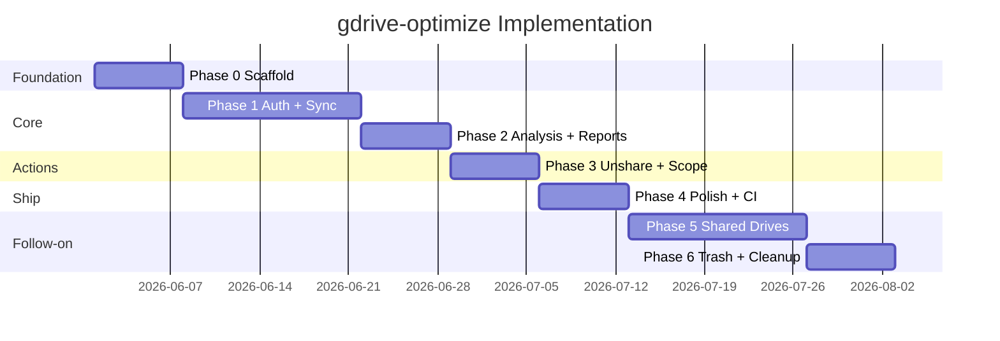

# Implementation Roadmap

> Companion to [00-master-plan.md](./00-master-plan.md)
> **Status:** live `My Drive` backend delivered after Phase 4 polish; Shared Drives remain deferred to Phase 5 (2026-06-01)

---

## Scope boundaries (v1)

| In scope | Deferred |
|----------|----------|
| My Drive corpus (not Shared Drives) | Shared Drives → **Phase 5** |
| `drive.metadata.readonly` at login | Full `drive` scope → on first write |
| Sync, find, report, `unshare`, recoverable `trash` | Permanent delete / empty-trash → **Phase 6** |
| Local SQLite plus private visible-folder remote sync | Hidden `appDataFolder` DB mode → Phase 7 |

---

## Phase overview

---

## Phase 0 — Scaffold

**Status:** Complete

**Deliverables**

| Item | Done when |
|------|-----------|
| Cargo workspace (5 crates) | `cargo build` succeeds with no cyclic dependencies |
| Makefile | `make help`, `build`, `test`, `lint`, `clean` work |
| CLI skeleton | `gdrive-optimize --help` and top-level subcommand help pages show full command tree and examples |
| DB migrations | Empty schema applies cleanly |
| Repository conventions | SemVer, Conventional Commits, PR-title format, branch naming, and signed-commit policy are documented |
| Core architecture docs | `overview.md`, `sync-engine.md`, and `path-model.md` exist with initial diagrams |
| CLI UX design doc | RGB palette, reactive states, non-TTY fallback rules documented |
| Testing docs | `testing/strategy.md`, `testing/fixtures.md`, and `testing/acceptance.md` exist |
| Test tree skeleton | package-local test directories and shared `tests/fixtures`, `tests/snapshots`, `tests/config` layout exist with plan-defined suite names |

**Exit criteria:** CI-ready repo structure; no Google API calls yet; dependency direction, sync recovery model, standalone mock backend contract, and CLI/help conventions are locked before feature coding.

---

## Phase 1 — Auth + Sync

**Deliverables**

| Item | Done when |
|------|-----------|
| `auth login/logout/status` | OAuth with `drive.metadata.readonly` |
| Core ports + mocks | `DriveGateway` + repositories fully testable in isolation |
| Mock backend | `MockDriveGateway` loads deterministic fixture datasets with no network and supports persisted mock auth state |
| Full bootstrap sync | Checkpoint token + full crawl + replay to staging + atomic commit |
| Delta sync | `changes.list` + `restrictToMyDrive=true` + committed token journal |
| Crash recovery | Interrupted sync leaves prior committed snapshot intact |
| Trash handling | Files moved to trash removed from local DB |
| Path cache | Human-readable paths generated; orphaned items explicitly marked |
| `sync` command | Reactive TTY progress + deterministic non-TTY summary |
| Global operator controls | `--help`, `--verbose`, `--quiet`, and `--no-interactive` behave consistently |
| Integration suite | migrations, journaling, path cache, and crash recovery pass |

**Exit criteria:** Operator can sync My Drive, rerun delta-only, recover cleanly from interruption, query readable paths without opening the web UI, and the phase is verified offline on mock data.

---

## Phase 2 — Analysis + Reports

**Deliverables**

| Item | Done when |
|------|-----------|
| Duplicate engine | MD5 + heuristic groups |
| Sharing engine | Public links, external emails, inherited permissions, non-actionable cases |
| Storage engine | Quota, large/stale files |
| `report *` commands | Markdown with exec summary, paths, ownership, and actionability |
| `find *` commands | Filtered terminal output using path/share filters with adaptive RGB tables |
| Functional suite | `find`, `report`, `inspect`, help pages, and mock auth commands pass against fixture datasets |

**Exit criteria:** `report all -o reports/` produces an actionable pack that distinguishes what the operator can fix now from what is only informational.

---

## Phase 3 — Mutations (unshare only)

**Deliverables**

| Item | Done when |
|------|-----------|
| Scope upgrade | Re-auth with `drive` scope on first write |
| `unshare` | Removes direct removable permissions with flag-based filters (`unshare [filters...]`) |
| Audit log | All writes recorded |
| Alternative-flow handling | Inherited/non-owned permissions surface explicit reason codes |
| Reactive preview UX | Dry-run previews and apply summaries adapt to TTY vs non-TTY |
| Mutation safety controls | `--dry-run`, `--apply`, and `--yes` behave exactly as documented |
| Post-mutation sync | Inventory stays consistent |
| Functional mutation suite | dry-run/apply flows verified against mutable mock datasets |

**Exit criteria:** Operator can unshare safely from CLI, understand why some files cannot be changed, and trust the post-action inventory.

---

## Phase 4 — Polish

**Status:** Complete

**Deliverables**

| Item | Done when |
|------|-----------|
| Shell completions | bash, zsh, fish |
| Operator docs | getting-started + runbooks |
| GitHub Actions CI | fmt, clippy, and production-library coverage reporting |
| `inspect exif` | On-demand; may request `drive.readonly` |
| Acceptance suite | end-to-end standalone flows pass on mock data |

**Exit criteria:** offline acceptance stays green with no network or secrets, and the follow-on live `My Drive` smoke checklist passes before release.

---

## Phase 5 — Shared Drives (follow-on)

**Status:** Deferred

**Deliverables**

| Item | Done when |
|------|-----------|
| API flags | `supportsAllDrives`, `includeItemsFromAllDrives` |
| Config | `include_shared_drives = true` |
| Sync | Enumerate and inventory shared drives operator can access |
| Reports | Filter/group by drive ID |
| Docs | `architecture/shared-drives.md` |

**Exit criteria:** Operator can sync and audit Shared Drives alongside My Drive.

---

## Phase 6 — Permanent trash cleanup (deferred)

**Deliverables**

| Item | Done when |
|------|-----------|
| Opt-in trash sync | Separate table or flag (operator choice) |
| `cleanup trash` | Recoverable move-to-trash workflow shipped earlier with dry-run + apply |
| `empty-trash` | Guarded permanent delete |
| Trash reports | Storage reclaimed, items pending purge |

**Exit criteria:** Full cleanup workflow including optional permanent trash management.

---

## Phase 7 — Backlog (post-v1)

- Optional hidden Remote SQLite on Drive `appDataFolder`
- Multi-account profiles
- OS keyring token storage
- `changes.watch` daemon for near-real-time sync
- TUI exploration mode
