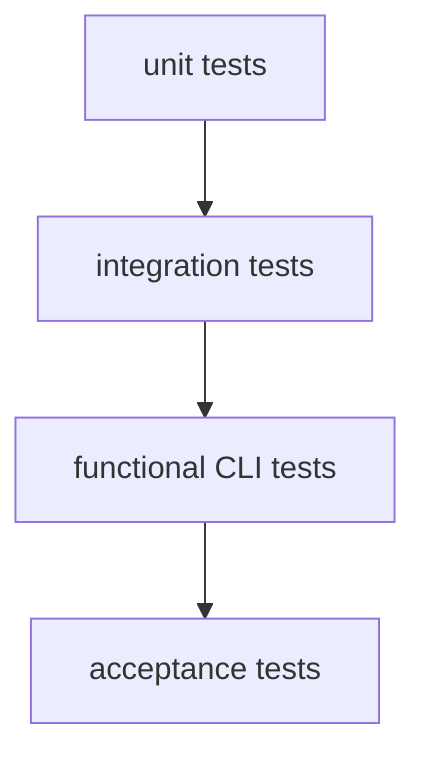

# Testing Strategy

## Purpose

Phase 0 fixes the test pyramid, suite ownership, and offline-first verification approach before implementation expands.

## Pyramid

## Rules

- unit tests cover library logic
- integration tests validate DB and orchestration seams
- functional and acceptance tests run on mock data only
- shared fixtures live under `tests/fixtures/`
- package-local test targets own suite execution

## Phase 0 output

- crate-local test directories exist
- required suite names are reserved
- Make targets map to the planned suite structure
